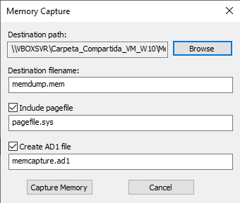
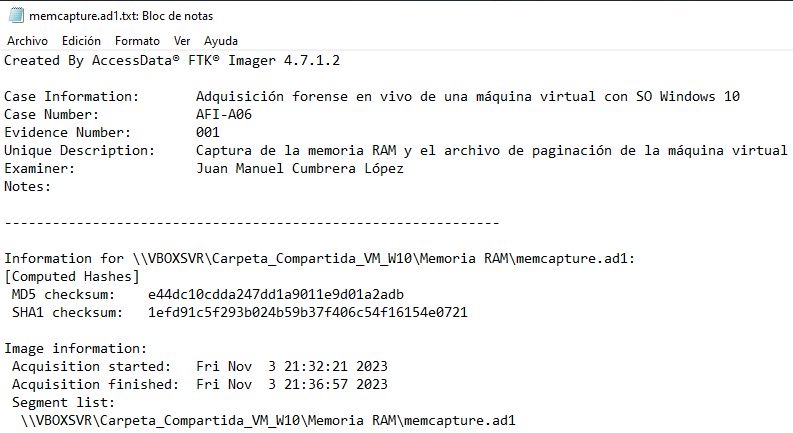
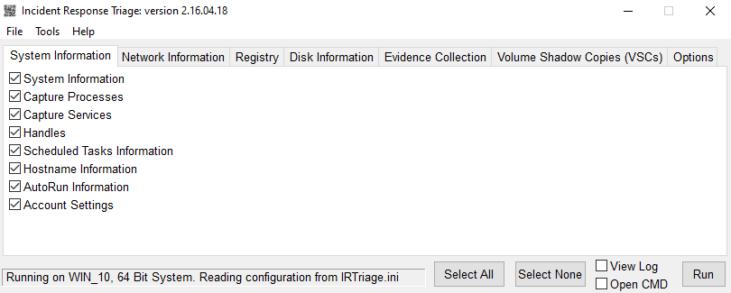
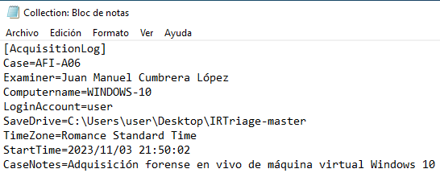
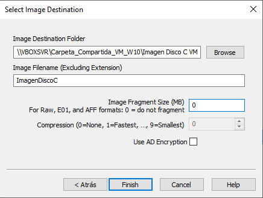
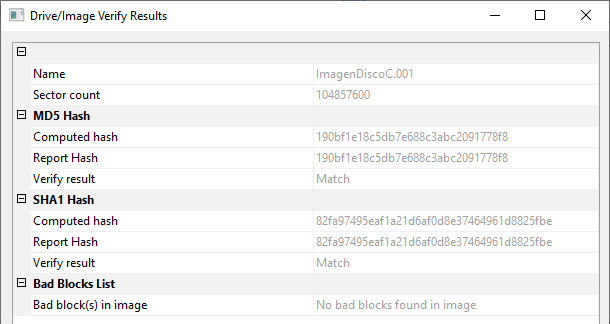

# Adquisición Forense en vivo de una máquina Windows

Para la realización de la siguiente práctica contaremos con una máquina virtual con el SO Windows 10, así como VirtualBox para trabajar con ella.

Para comenzar con la adquisición en vivo de esta máquina virtual, debemos referirnos a la sección de adquisición de la metodología previamente desarrollada para la práctica del análisis forense informñatico. En esta ocasión realizaremos tan sólo el paso de la adquisición, y por ello nos remitiremos a la susodicha sección en la metodología forense desarrollada.

En la sección de adquisición de evidencias previamente mencionada se detallan  puntos a tener en cuenta, siendo estos el valor relativo probable de las fuentes de evidencia, el esfuerzo requerido para obtenerlas y la volatilidad.

Teniendo en cuenta el caso que nos ocupa, en el que disponemos de una única fuente de evidencia que es la máquina virtual con sistema operativo Windows 10, debemos centrarnos en obtener primero las evidencias más volátiles, por lo que decidimos realizar en primer lugar una captura de la ***memoria RAM*** de la máquina. Para esta tarea hemos elegido el software ***FTK Imager*** de AccessData.

Como carpeta de destino de la captura de la memoria RAM, hemos creado una carpeta compartida, a fin de no colapsar el escaso espacio del disco de la máquina.

Una vez finalizada la operación, obtenemos en la susodicha carpeta tanto el volcado de memoria RAM, así como una captura del archivo de paginación y un archivo en formato txt con datos sobre la captura.
Debemos recordar que este archivo es usado por Windows como una extensión de la memoria RAM física, a fin de manejar el intercambio de datos entre la RAM y el almacenamiento de disco. 

Una vez que hemos obtenido tanto la memoria RAM como el archivo de paginación de la máquina virtual, debemos centrarnos en elementos del sistema con un orden inmediatamente inferior en términos de volatilidad tales como ***tablas de procesos y servicios*** del sistema. Haciendo uso de la herramienta de triage ***IRTriage-Master***, podremos obtener rápidamente una gran cantidad de datos importantes del sistema a analizar, entre los que tenemos información general del sistema, información de la red, registros o información del disco.Para comenzar, rellenamos la información relativa al caso y comenzamos la operación.

Una vez terminada la operaración de triage, podremos ver la carpeta recién creada, con la totalidad de los datos extraídos por la aplicación.

Dentro de dicha carpeta, podremos ver un fichero Collection.txt con información general de la extracción, así como una carpeta Evidence, conteniendo los datos extraídos.

Finalmente, habiendo adquirido los datos más volátiles de la máquina virtual con anterioridad, podremos obtenemos una imagen del disco de la misma, finalizando la operación de adquisición de la máquina virtual. Para llevar a cabo este proceso hemos vuelto a elegir la aplicación ***FTK Imager*** de AccessData, debido a la sencillez de uso y su efectividad durante la extracción y adquisición de datos o imágenes de discos o información del sistema. En esta ocasión hemos vuelto a optar por usar la carpeta compartida, debido a la falta de espacio en el disco de la máquina virtual. 

Esta herramienta además, te permite comprobar los hashes tanto del disco original como de la imagen adquirida, a fin de garantizar la integridad y fiabilidad de las evidencias.

Cuando se ha terminado la operación, podemos ver la imagen adquirida del disco de la máquina virtual, así como un fichero en formato txt con información general acerca del proceso de adquisición de la imagen del disco.

Con estas operaciones hemos logrado obtener con precisión los datos volátiles y no volátiles de la máquina virtual elegida, además de haber verificado los hashes durante todo el proceso, asegurándonos de la integridad y fiabilidad de los datos obtenidos, lo cual podemos comprobar en los ficheros autogenerados, con información general sobre los procesos llevados a cabo.